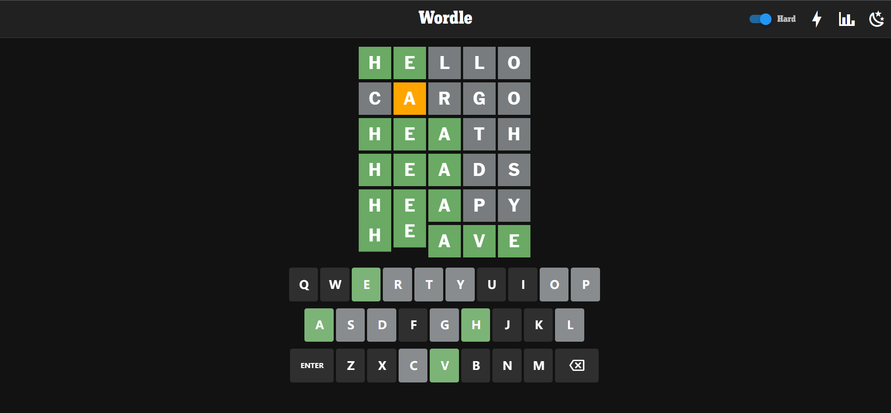

# Wordle 大作业报告

## 1 程序架构说明

### 1.1 项目目录结构

```text
wordle-hc-zhang22
├── pkg     // wasm-bindgen 生成的 js 代码
├── res     // 程序用到的资源文件
├── src     // rust程序源代码
├── target  // cargo 生成的编译结果
├── tests   // 测试用例
└── www     // web 端代码
    ├── dist            // release版本编译结果
    ├── node_modules    // 依赖文件
    ├── public          // 静态资源
    └── src             // 前端源代码
```

### 1.2 程序架构

```text
src
├── builtin_words.rs    // 内建词库
├── core.rs             // 程序逻辑核心，主要负责进行核心逻辑运算
├── interface.rs        // 交互界面接口，主要负责单次交互的执行逻辑
├── lib.rs              // 用于生成 wasm 的入口
├── main.rs             // 用于生成可执行文件的入口，主要负责命令行参数解析和主执行逻辑
├── test_interface.rs   // 测试模式界面的实现，主要负责实现对应::interface::Interface接口
└── tty_interface.rs    // 交互模式界面的实现，同上
```

游戏的核心逻辑由`::core::GameStatus`负责。

游戏的命令行界面**运行逻辑**由`::interface::run`负责，其直接面向`::interface::Interface`接口。

`::test_interface::TestInterface`和`::tty_interface::TTYInterface`分别实现了`::interface::Interface`接口中定义的各项要求操作，
负责具体的输出的格式和方法。

命令行参数的解析及其对应需求由于没有复用需要故直接放在主函数中实现，对应部分皆有相应注释。

提高功能要求实现编译到wasm，需要暴露给前端的接口以及相应的游戏逻辑则全部放在`lib.rs`中实现，详见后述。

## 2 主要功能说明

### 2.1 测试模式界面

严格按照文档要求实现了全部功能，可以通过全部测试样例，不再赘述。

### 2.2 交互模式界面

在测试模式之上，这一部分实现了更加精美的界面和更加详细的提示。


有好看的ASCII艺术字，输入大小写均支持，有丰富的色彩、字体和详细的提示。每次输入前会有剩余次数提示。


错误后会给出正确答案。


困难模式下，针对困难模式的额外要求，会有更多提示。

### 2.3 WebUI界面

仿照原版wordle的界面，我实现了一个相似的界面。


我还原了原版界面的主要样貌特征和大部分功能，并加以改进。
首先我**移除了广告**。
其次我简化了上方工具栏，将常用功能直接暴露在右上角。
从左到右依次是困难模式，快速模式，数据统计，主题切换。
其中**快速模式**指的是省去一些动画，使游戏节奏更加紧凑。
除此之外，我的界面更加注重**无障碍**，黄色的选择比原版更加鲜艳，更加方便色盲色弱患者。
图中刚刚按下回车，卡片正在依次翻出。


这是点击右上角太阳后变化为黑暗模式的界面。
图中正在进行的动画是按下字母以后卡片的弹跳动画。


如果输入单词数量不足或所输入单词不在词库，那么对应行会抖动并且弹出提示。



如果答对，那么单词就会逐个弹跳。并且弹出数据统计界面。


这些数据的展示规则与文档中要求基本一致。
与原版不同的是，此处增加了重新开始游戏的选择。
数据信息以及主题模式都存储在浏览器的`Local Storage`中。


不仅如此，我还十分注重兼容性，我确保了整个游戏界面在手机端也可以正常显示和体验。


在`Google LightHouse`的测试报告中显示，我的界面在一些指标上优于原版。


我将这个网页部署到了Vercel上，对于更多功能，可以访问<https://wordle-zhc7.vercel.app>体验。
由于制作仓促，可能存在一些bug，请多多包涵。

同时这里我需要声明，由于目标是模仿官方界面，因此CSS动画部分的`keyframes`我直接复制了官方的代码，字体文件也来源于wordle官方网站。

## 3 提高要求实现方式

### 3.1 WebAssembly

在实现WebUI的过程中，游戏的核心逻辑都复用了`core.rs`的代码，
在`lib.rs`中利用`struct Runner`进行了统一包装，
并用`wasm-bindgen`导出将其暴露给了前端，生成的代码在`./pkg`中。

### 3.2 WebUI

与游戏本身逻辑无关的部分，为了短时间内实现一个好看且高性能的UI，
我选择了`Vuetify + Vue`进行开发，使用了少量`javascript`代码，
其主要作用在于绘制界面、响应用户和制作动画等。

### 3.3 快速体验

除了访问上文中的链接外，也可以在本地构建和运行。

首先请确保已经安装`wasm-pack`和`yarn`，分别用于构建`wasm`和管理`Vue`依赖。

在项目根目录下运行

```bash
wasm-pack build
```

此命令将会构建`wasm`代码并将其放置在`./pkg`中。

然后进入`www`目录，这里是`Vue`项目的根目录，运行

```bash
yarn install
```

安装必要的依赖，这当然也包括刚刚构建的`wasm`，详细可以查看`package.json`。

最后运行

```bash
yarn dev
```

在本地以开发模式运行，根据提示即可。

如果没有`yarn`，用`npm`也可以，不过这未经过我的测试。

## 4 感想

整体来说这次作业的设计还是非常有意思也非常富有挑战性的。
也引导我尝试了之前一直想但都没敢做的`WebAssembly`。
这里必须要感叹`Rust`生态的强大之处了，整个过程比我想象的要顺畅许多。

最后的提高功能也就是WebUI其实是一个比较赶的工作，
由于我自己过于乐观地估计了时间，导致最后写附加功能的时间最后只剩了两三天。
高强度写前端还是很有意思的，看着页面逐渐成型还是非常有成就感的。

说到这里，我又想起，其实在做基础功能部分，感觉做的过程反倒并没有我想象的顺利。
其实这有很大原因在我自身，我没有通读文档就开始写代码了。
虽然刚开始小心翼翼地设计了架构，可是最后还是没能逃过重构的命运。
最开始我虽然想到了，但是还是觉得设计`trait Interface`是多此一举，
交互的代码完全分开写不会有什么问题。
但没想到后面越做越复杂，最终还是决定将两个分开设计的界面的公共逻辑部分合并，
然后将界面本身抽象成了`trait`。

在设计过程中其实也是体验真实环境的开发的一种经历，
也就是下一个功能并不一定是基于前面的工作的，
而且反倒有可能是相互矛盾，甚至需要推到重来的。
大的重构不多但小的重构还是进行了不少次的。

又突然想到令我震惊的一点，就是`Rust`的生态真的太强了，
我刚开始着实没想到颜色输出可以这么简单，也没想到`Rust`的包管理这么方便，而且这么和谐统一。
在我心中在这一点上已经胜过了`Python`和`javascript`这两个以生态著称的语言。

总的来说，`Rust`还是很有意思的。